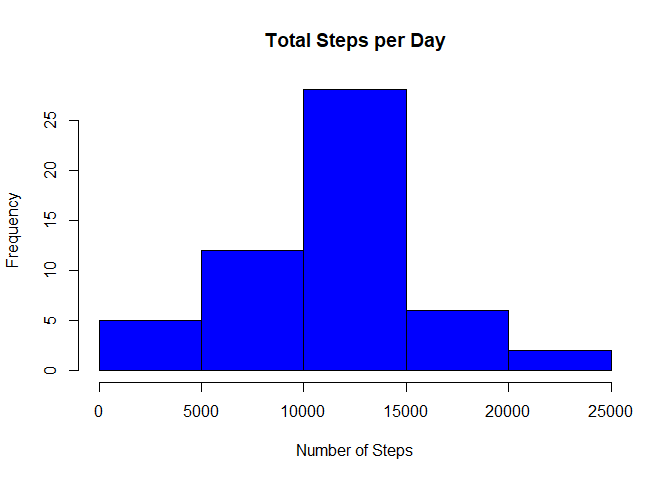
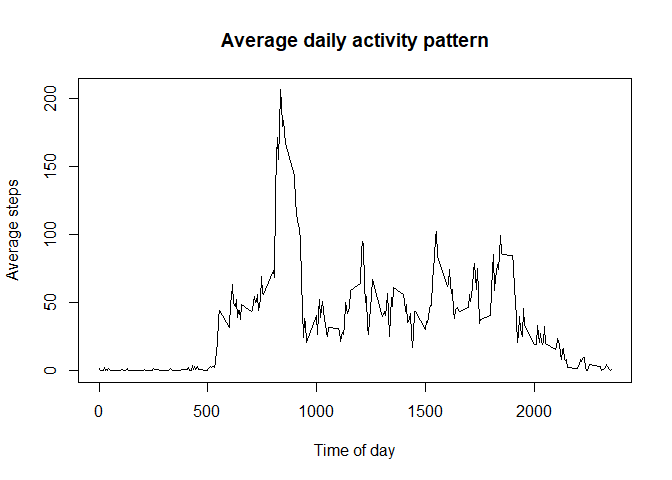
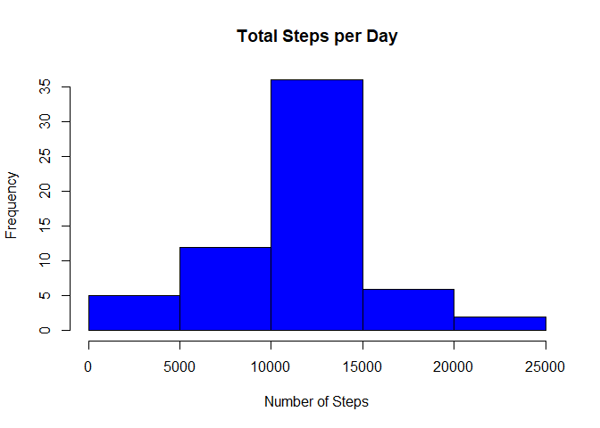
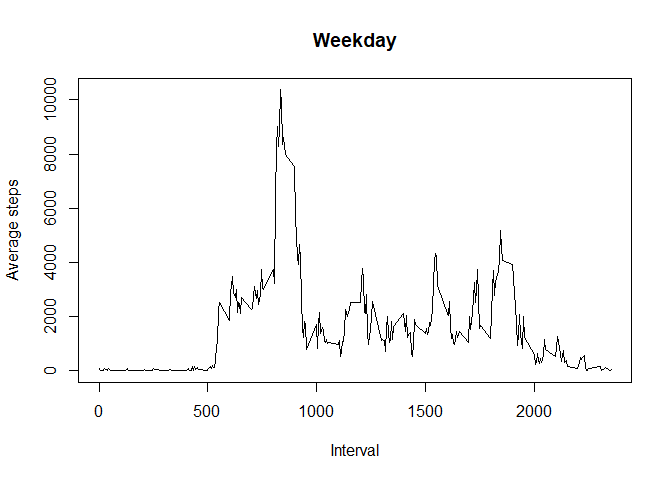
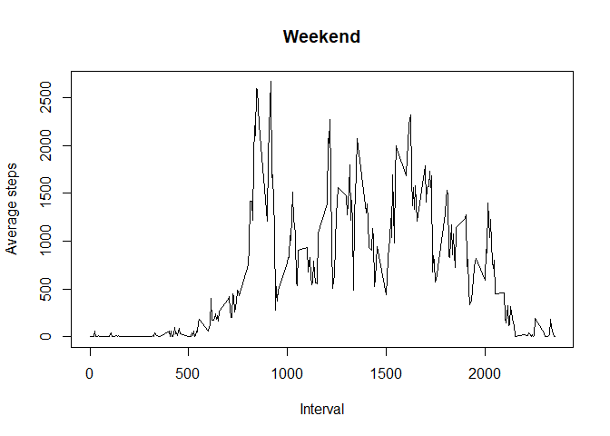

# Reproducible Research Peer Assessment 1
This markdown file belongs to Peer Assessment 1 of the Reproducible Research Course of Coursera. In the next steps the answers to the project are given

## Loading and preprocessing the data
In this step we load the data from the file. Make sure the file 'activity.csv' is given in your working directory. 


```r
data <- read.csv('activity.csv')
```

## What is mean total number of steps taken per day?
Next we want to know the mean total number of steps taken per day. Therefore we first sum the number of steps per day and then we give the mean and meidan of total number of steps taken per day. 


```r
steps_per_day = aggregate(steps ~ date, data, sum, na.rm = TRUE)
meansteps <- mean(steps_per_day$steps, na.rm = TRUE)
mediansteps <- median(steps_per_day$steps, na.rm= TRUE)
```
The mean number of steps taken per day = 1.0766189\times 10^{4} and the median of steps taken per day = 10765.
The histogram of the number of steps per day is as follows:

```r
hist(steps_per_day$steps, 
     main = 'Total Steps per Day', 
     xlab = 'Number of Steps',
     col = 'blue')
```

<!-- -->
## What is the average daily activity pattern?
Now we give the average daily daily activity pattern in a plot of the 5-minute interval and the average number of steps taken. 


```r
steps_per_interval <- aggregate(steps~interval, data, mean)
plot(steps_per_interval$interval, steps_per_interval$steps, type = 'l', main = 'Average daily activity pattern', ylab = 'Average steps', xlab = 'Time of day' )
```

<!-- -->
THe maximum number of steps across all days is given during the interval:

```r
steps_per_interval[which.max(steps_per_interval$steps),]$interval
```

```
## [1] 835
```

## Imputing missing values
The are a number of days/intervals where there are missing values. This may lead to some bias of the data. In the following, we calculate the number of missing values in the dataset. 


```r
missing_values <- sum(is.na(data$steps))
```
In total, there are 2304 missing values in the dataset. 

To fill in all the missing values in the dataset, we change the NA's tot he mean of the value for that moment of interval. 

```r
newdata <- data

for (i in 1:dim(data)[1]){
      if(is.na(newdata$steps[i])){
            newdata$steps[i] <- steps_per_interval$steps[steps_per_interval$interval == data$interval[i]]

      }
}
```
Now we reproduce the histogram of the newdata set with values for the missing values. 


```r
new_steps_per_day <- aggregate(steps ~ date, newdata, sum)

hist(new_steps_per_day$steps, 
     main = 'Total Steps per Day', 
     xlab = 'Number of Steps',
     col = 'blue')
```

<!-- -->

```r
new_meansteps <- mean(new_steps_per_day$steps)
new_mediansteps <- median(new_steps_per_day$steps)
```
The new mean is 1.0766189\times 10^{4} and did not really changed, the median is now 1.0766189\times 10^{4} and is closer to the mean. 

## Are there differences in activity patterns between weekdays and weekends?
Last, we want to see if there are any differences in the number of steps per weekday or weekendday. 


```r
library(dplyr)
```

```
## 
## Attaching package: 'dplyr'
```

```
## The following objects are masked from 'package:stats':
## 
##     filter, lag
```

```
## The following objects are masked from 'package:base':
## 
##     intersect, setdiff, setequal, union
```

```r
newdata$weekday <- weekdays(as.Date(newdata$date))
newdata_weekday <- newdata %>% filter(weekday == "maandag"| weekday =='dinsdag'| weekday =='woensdag' | weekday =='donderdag'| weekday =='vrijdag')
newdata_weekend <- newdata %>% filter(weekday == 'zaterdag' | weekday == 'zondag')

weekday_steps_per_day <- aggregate(steps ~ interval, newdata_weekday, sum)
weekend_steps_per_day <- aggregate(steps ~ interval, newdata_weekend, sum)

plot(weekday_steps_per_day$interval, weekday_steps_per_day$steps,type = 'l', main = 'Weekday', ylab = 'Average steps', xlab = 'Interval')
```

<!-- -->

```r
plot(weekend_steps_per_day$interval, weekend_steps_per_day$steps,type = 'l', main = 'Weekend', ylab = 'Average steps', xlab = 'Interval')
```

<!-- -->

